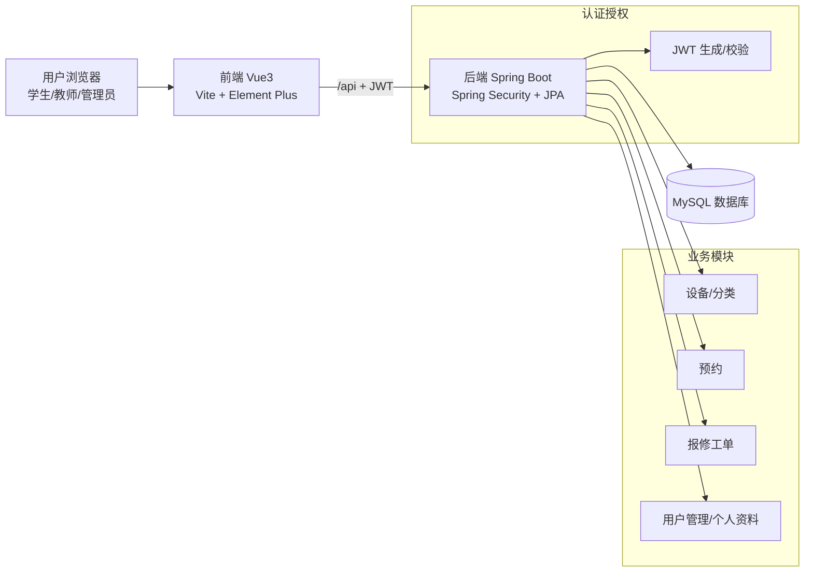
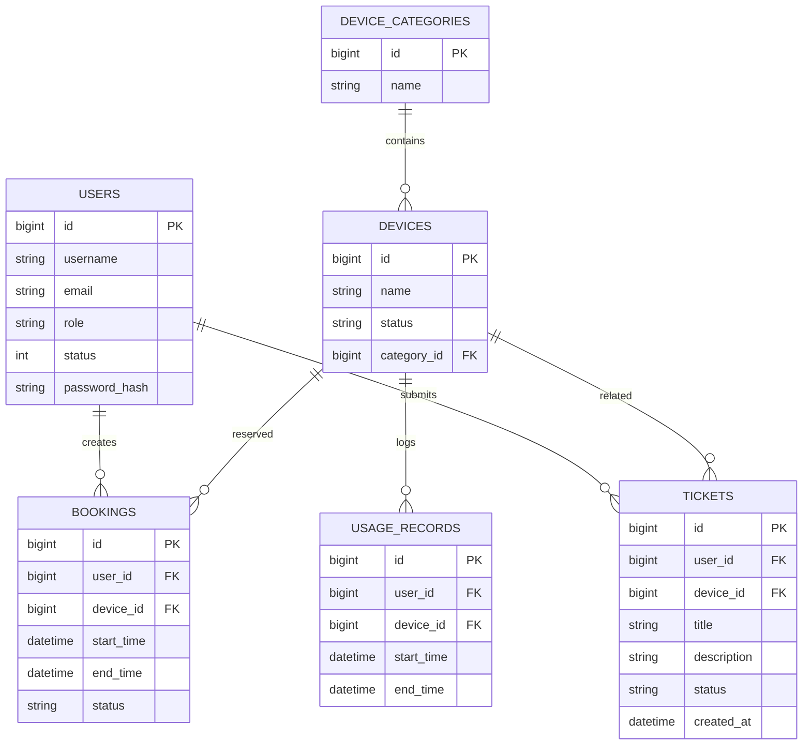

# SharedLab 共享实验室平台｜答辩PPT（Markdown）

> 用法：将本文件按页分隔符 `---` 导入/粘贴到任意“Markdown 转 PPT”的 AI 或工具中。
>
> 项目目录：`C:\SharedLab\`（后端 `backend/`，前端 `frontend/`）

---

## 1. 项目封面

- 项目名称：SharedLab 共享实验室平台
- 项目目标：设备预约、使用记录、报修工单、角色权限管理
- 适用人群：学生 / 教师 / 管理员
- 技术栈：Spring Boot + Spring Security + JPA + MySQL；Vue3 + Vite + Element Plus + Pinia

---

## 2. 背景与痛点

- 实验室设备管理分散：设备信息不统一、状态不透明
- 预约流程不规范：冲突难发现、审核/管理成本高
- 报修闭环缺失：问题追踪、处理状态、统计分析困难
- 权限边界不清：不同角色能做什么缺少系统化约束

---

## 3. 项目目标（解决什么）

- 设备资源在线化：设备列表、分类、详情、可用状态
- 预约流程标准化：创建预约、冲突校验、我的预约
- 设备问题闭环：提交报修（工单）、状态流转、我的报修
- 安全权限体系：基于角色（Admin/Teacher/Student）的访问控制
- 可部署可测试：提供部署文档、构建产物、基础测试方案

---

## 4. 用户角色与权限矩阵（核心）

- 学生（STUDENT）

  - 浏览设备、查看详情
  - 创建/查看自己的预约
  - 提交/查看自己的报修
  - 修改自己的个人信息、修改自己的密码
- 教师（TEACHER）

  - 浏览设备、查看详情
  - 查看/管理预约（项目现实现状：教师路由复用管理页面）
  - 查看/管理报修（项目现实现状：教师路由复用管理页面）
  - 修改自己的个人信息、修改自己的密码
- 管理员（ADMIN）

  - 用户管理：新增/编辑/启用禁用/删除/批量删除
  - 设备分类管理、系统日志（按现有页面）
  - 修改自己的个人信息、修改自己的密码

---

## 5. 系统总体架构

- 前端：Vue3 + Vite

  - UI：Element Plus
  - 状态管理：Pinia（auth/device 等）
  - 网络：Axios（`baseURL: /api`，携带 Bearer token）
- 后端：Spring Boot

  - 安全：Spring Security + JWT
  - 数据：JPA/Hibernate + MySQL
  - 分层：Controller / Service / Repository

---

## 6. 架构图（可直接转PPT）

---

## 7. 关键业务流程 ①：登录与鉴权

- 登录：`POST /api/auth/login`
  - 后端验证用户名/密码
  - 签发 JWT token
- 前端保存：localStorage（token + user）
- 访问受保护接口：Axios 自动附加 `Authorization: Bearer <token>`

---

## 8. 关键业务流程 ②：设备浏览

- 设备列表：`GET /api/devices`
  - 支持筛选参数（如 `status`、`categoryId`）
- 前端展示：设备卡片/列表 + 详情页
- 价值：让用户在预约前能清晰了解设备信息与状态

---

## 9. 关键业务流程 ③：预约（Booking）

- 创建预约：提交设备、时间段等
- 冲突校验：避免同设备同时间段重复占用
- 我的预约：用户查看自己的预约记录

> 注：本页描述匹配“预约模块”的业务意图；具体字段/页面以项目现有实现为准。

---

## 10. 关键业务流程 ④：报修（Ticket）

- 用户提交报修：描述问题、关联设备
- 状态流转：跟踪处理进度（如新建/处理中/已完成等）
- 我的报修：用户查看自己的报修列表与处理状态

---

## 11. 数据库设计（表概览）

> 表结构来源：后端 JPA 实体（ddl-auto=update）与项目数据字典整理。

- `users`：用户（账号、邮箱、角色、状态、密码哈希）
- `device_categories`：设备分类
- `devices`：设备
- `bookings`：预约
- `usage_records`：使用记录
- `tickets`：报修工单

---

## 12. 数据库设计（关系示意）

---

## 13. 后端模块划分（Controller / Service / Repository）

- Controller：HTTP 接口层，做参数校验、权限注解
- Service：业务规则（冲突校验、唯一性校验、状态变更）
- Repository：JPA 数据访问

**典型特点**

- DTO 与 Entity 分离：避免直接暴露实体
- 统一异常处理：`GlobalExceptionHandler` 返回标准错误结构

---

## 14. 安全设计（Spring Security + JWT）

- 认证：JWT 过滤器解析 token，注入 SecurityContext
- 授权：
  - `/api/auth/**`、`/api/devices/**`、`/api/device-categories/**` 允许匿名访问（按现配置）
  - 其他 `/api/**` 需要认证
  - 管理员接口 `@PreAuthorize("hasRole('ADMIN')")` 强制限制

---

## 15. 个人中心能力

**问题**

- 之前：个人信息修改只能走管理员的 `/api/users/**`（学生/教师无权限）

**解决**

- 新增自助资料接口：
  - `GET /api/profile/me` 获取当前用户
  - `PUT /api/profile/me` 修改 `username/email`
- 新增自助改密码接口（需旧密码）：
  - `PUT /api/profile/me/password`（校验旧密码后更新）

---

## 16. 前端实现要点

- 路由分区：`/student/*`、`/teacher/*`、`/admin/*`
- 侧边栏菜单：根据角色展示导航
- 统一 API 调用：`frontend/src/services/api.js`
- 新增“我的信息”页面：
  - 展示/编辑 username、email
  - 改密码：旧密码 + 新密码
  - 成功后更新本地用户信息；改密码后强制重新登录

---

## 17. 管理端用户管理（已实现增强点）

- 移除“状态”列展示冗余
- 补齐操作：编辑 / 启用禁用 / 删除
- 增加批量删除：支持选择多条记录一键删除
- 构建验证：前端 `npm run build` 通过

---

## 18. 测试方案（功能 + 接口）

- 功能测试用例（文档已产出）
  - 登录/注册
  - 预约/报修
  - 用户管理
- 接口测试（JMeter）
  - 说明：200 但标红常见原因是断言配置不当
  - 建议：
    - Response Assertion 使用 Contains/Matches 时注意空数组 `[]` 情况
    - 不要把 `[]` 当正则表达式（会触发正则解析错误）

---

## 19. 部署与运行（快速说明）

- 后端：JDK 21 + Maven
  - 构建：`mvn -DskipTests package`
  - 产物：`backend/target/shared-lab-platform-1.0.0.jar`
- 前端：Node.js + npm
  - 构建：`npm run build`
  - 开发代理：Vite proxy `/api -> http://localhost:8080`

---

## 20. 演示脚本

1) 管理员登录

- 进入“用户管理”：展示编辑/启用禁用/删除/批量删除

2) 学生登录

- 浏览设备列表 → 点进设备详情
- 进入“我的信息”：修改邮箱；修改密码（输入旧密码）→ 自动退出重新登录

3) 教师登录（如需）

- 查看预约/报修管理页面（按现路由配置）

---

## 21. 项目亮点总结

- 端到端闭环：设备 → 预约 → 使用/记录 → 报修 → 管理
- 权限清晰：管理员管理用户；普通用户自助资料与改密码
- 可维护结构：后端分层 + DTO；前端路由分区 + store 管理
- 交付完整：文档、构建产物、测试用例与数据准备

---

## 22. 风险与后续优化（可选）

- JWT 场景：修改用户名/密码后 token 失效策略（当前做法：前端强制重新登录）
- 数据质量：设备状态值规范化（避免拼写不一致导致筛选异常）
- 测试完善：增加自动化接口测试覆盖关键路径

---
